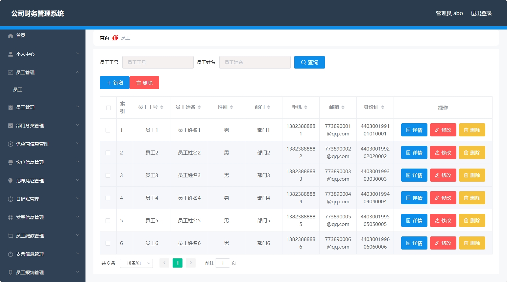
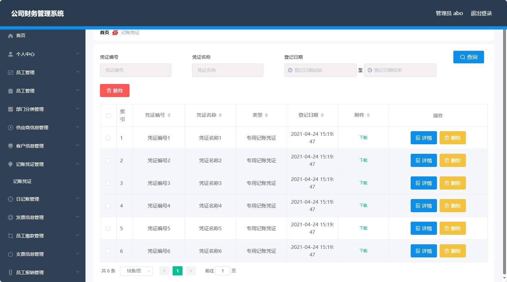
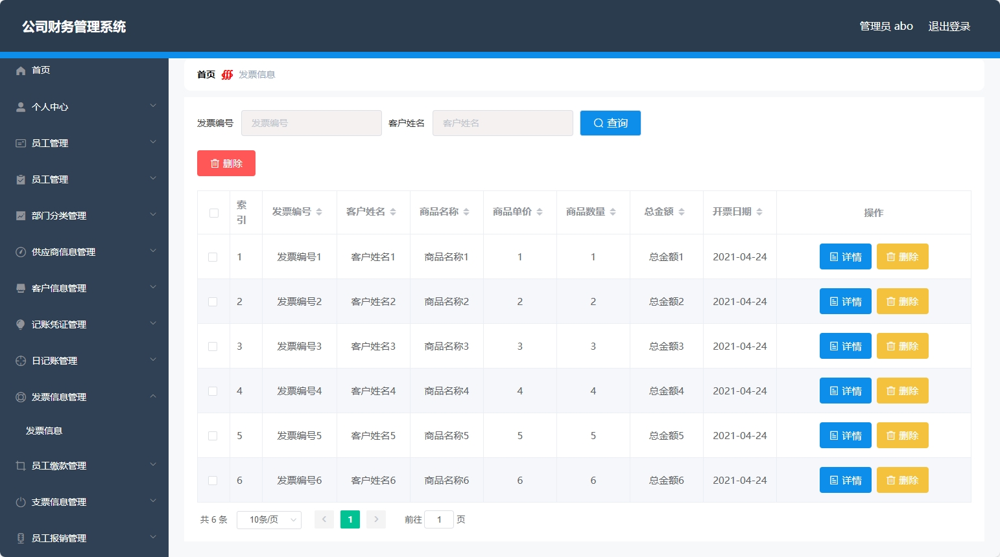
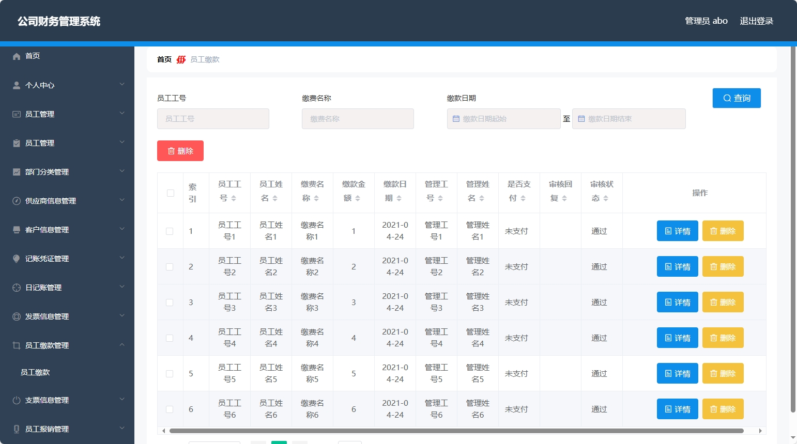
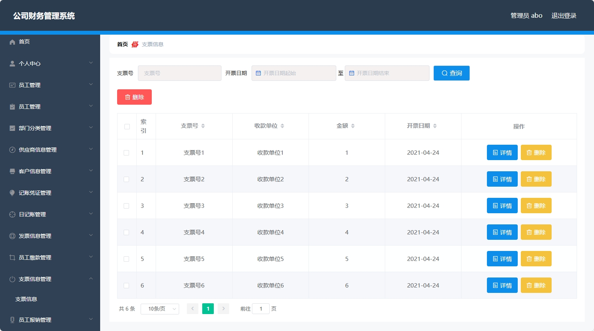
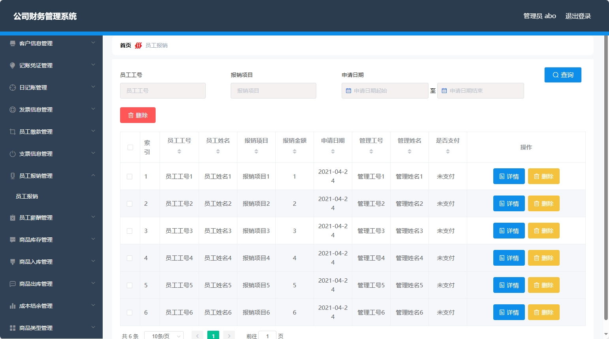
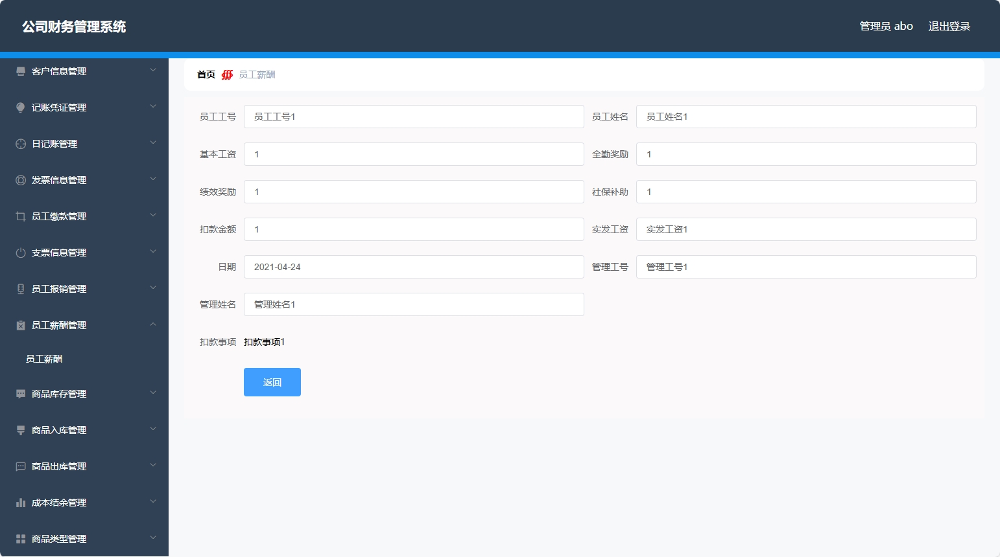
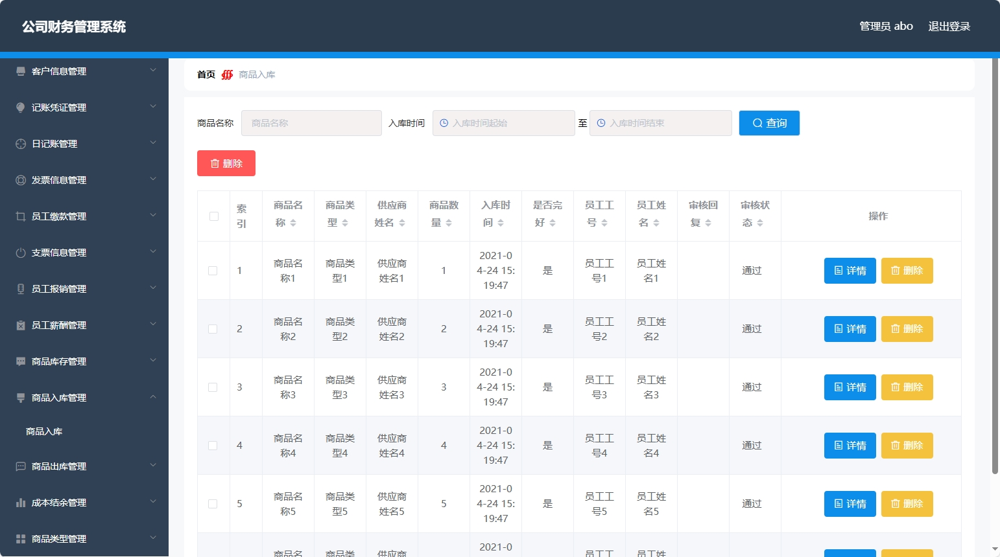
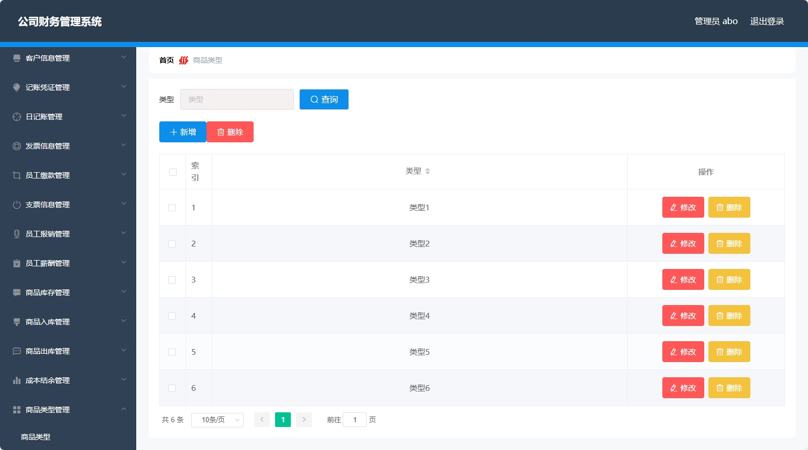

# 公司财务管理系统(数据库加VX获取☟)
> VX：13033494971
#### 介绍
公司财务管理系统
有BUG可留言加微

#### 软件架构
Java + SSM（Spring+SpringMVC+Mybatis） + Vue + Mysql

#### 项目说明

> + 多用户登录
> + 注册
> + 个人中心
> + 员工管理
> + 部门分类管理
> + 供应商信息管理
> + 客户信息管理
> + 记账凭证管理
> + 日记账管理
> + 发票信息管理
> + 员工缴费管理
> + 支票信息管理
> + 员工报销管理
> + 员工薪酬管理
> + 商品库存（入库，出库）管理
> + 成本结余管理
> + 商品类型管理

### 部分功能演示

### 环境需求(可免费提供)
- idea/eclipse、jdk-1.8、maven-3.8.6、mysql、nodejs

## 有项目修改、安装调试需求 请联系微信

## 其他项目定制加微☝☝☝
